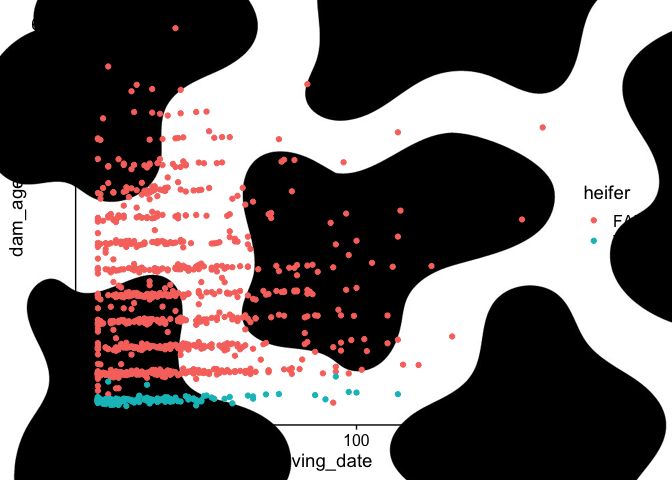
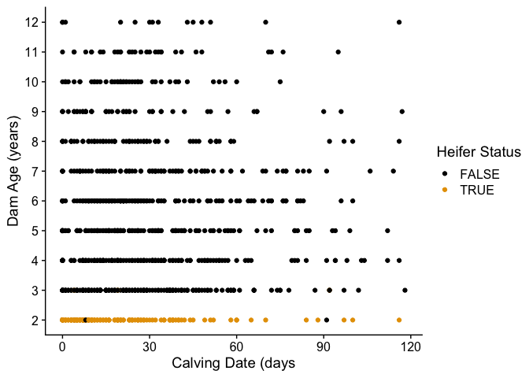

# badplot

# Bad Plot

Loading packages

``` r
library(tidyverse)
library(cowplot)
library(magick)
```

Loading Data

``` r
phenotypes <- read_csv("../data/badplot_data.csv") |> 
  rename("calving_interval" = "c_interval") |> 
  rename("calving_date" = "new_cd") |> 
  rename("discrete_date" = "dec")
  
glimpse(phenotypes)
```

    Rows: 1,000
    Columns: 7
    $ animal           <chr> "SIMUSAF000002138530", "SIMUSAF000009711298", "SIMUSA…
    $ heifer           <lgl> FALSE, TRUE, FALSE, TRUE, FALSE, FALSE, FALSE, FALSE,…
    $ group            <chr> "247581_2010_F_FALSE", "213878_2012_S_TRUE", "033912_…
    $ dam_age          <dbl> 3449, 689, 2635, 673, 4372, 2841, 2550, 4408, 1089, 3…
    $ calving_interval <dbl> 369, NA, 471, NA, 357, NA, 352, 387, NA, 361, NA, NA,…
    $ calving_date     <dbl> 10, 0, 40, 52, 1, 59, 4, 33, 32, 10, 29, 0, 7, 33, 28…
    $ discrete_date    <dbl> 1, 1, 2, 2, 1, 2, 1, 2, 2, 1, 1, 1, 1, 2, 1, 2, 3, 1,…

I went ahead and changed some column names so that they are easier to
understand.

Background about the data: This is a subset of phenotypes for animals
enrolled in Total Herd Enrollment (THE) with the American Simmental
Association (ASA). The columns are defined as followed:

animal: animal identification number

heifer: True means this is the animals first calf, FALSE means this is
not the animals first calf

group: contemporary group for animals based on owner number, year of
enrollment, season of enrollment, and heifer status

dam_age: age of animal at calving in days

c_interval: days between each calf for each animal

calving_date: day of the season the calf was born

discrete_date: categorical measure of calving date (1 = first 30 days, 2
= days 31-60, 3 = days 61-90, 4 = \>90 days)

## Bad Plot Code and Description

I want to make a plot that compares dam_age to calving_date for heifers
versus cows.

``` r
plot <- phenotypes |> 
  ggplot(aes(x = calving_date, y = dam_age, color = heifer)) +
  geom_point() +
  theme_cowplot()

ggdraw() + 
  draw_image("~/Documents/micr_575/homework/background.jpeg", scale = 2.0) +
  draw_plot(plot)
```



``` r
# ggsave("../homework/badplot.png", device = "png", width = 15, height = 7, units = "in")
```

So, on this plot it’s hard to see and understand on how calving date
relates back to the age of the animal (dam age). The scale and breaks
for the x and y axes are not the most informative. The x axis labels
probably make more sense since there is less variation in phenotypic
records. Neither axis shows what the numbers actually mean. On the x
axis, was does 50 mean? Days? Animals? We cannot be sure.

The background image creates issues because of the colors of the photo
and the axis labels and information. Tufte would argue that there is a
lot of unnecessary ink on this plot and Wilke would probably say that
this is not only an ugly plot, but a bad plot. No conclusions can really
be drawn from this plot beyond seeing the ages of heifers versus cows.
The idea of being able to put a picture behind the plot is an
interesting one, but it’s not worth losing information in an effort to
make really cool aesthetic plots. With this background, we cannot be
sure what the colors mean from the legend and cannot read the x axis
label.

## Good Plot Code and Description

Now, I actually want to see what the relationship between calving date
and dam age while also seeing which are heifer records.

First, I would change my dataset so that my dam ages are in years. I
also want to remove any outliers, such as animals older than 12 years of
age and who calved outside of 120 days.

``` r
updated.phenotypes <- phenotypes |>
  mutate(dam_age_years = round(dam_age/365)) |> 
  filter(dam_age_years <13, 
         calving_date <120) 
```

I also want to upload a colorblind friendly color pallette.

``` r
cbp2 <- c("#000000", "#E69F00", "#56B4E9", "#009E73",
          "#F0E442", "#0072B2", "#D55E00", "#CC79A7")
```

Now, I want to plot my data.

``` r
updated.phenotypes |> 
  ggplot(aes(x = calving_date, y = dam_age_years, color = heifer)) +
  geom_point() +
  scale_color_manual(values = cbp2) +
  scale_x_continuous(breaks = seq(0,150,30)) +
  scale_y_continuous(breaks = seq(0, 12, 1)) +
  labs(x="Calving Date (days", 
       y="Dam Age (years)", 
       color = "Heifer Status") +
  theme_cowplot()
```



``` r
# ggsave("../homework/goodplot.png",  device = "png", width = 15, height = 7, units = "in")
```

This is still not the best plot ever, but relationships between dam ages
and calving date can be seen. There’s a linear trend for each year where
we see how majority of records are more heavily distributed towards the
first 60 days of the calving season. The colors contrast better with
cows being black and heifers being gold. The terrible background has
been removed and the lack of grid lines allow for the points to contrast
better with the background. The breaks and labels on the x and y axes
are more informative and make more sense being separated by years and 30
day cut offs for calving season days. The label for the legend clearly
states what the colors are for and is easy to see.

This is a more minimalist plot and I think the simplicity of it aids in
understanding trends and relationships among cow age and calving seasons
look like for animals at various ages.

An interesting note on this plot are the 2 black points among the gold
heifer points. Those are most likely incorrect records since it’s almost
impossible for a cow to calve before two years of age so seeing two cow
records at that 2 year mark is interesting and would call for additional
analysis and cleaning of the data set.
