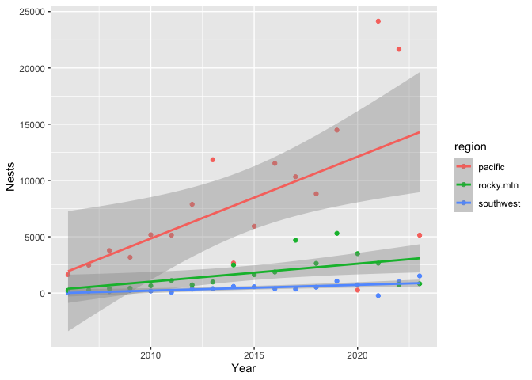

# class_sep25

Loading packages

``` r
library(tidyverse)
```

Loading the data set

``` r
nest_counts <- read_csv("../data/fake_eagle_nest_counts.csv")
View(nest_counts)
```

Is this data set tidy?

I would say that this data set is tidy since each column is a variable
(year, regions) with each row being a different year with one
observation per region. However, I think when it comes to data
visualization, changing this table to be longer with columns for year,
region, and nests would allow for easier plotting and comparisons.

To do this…

``` r
nest_longer <- nest_counts |> 
  pivot_longer(cols = c(pacific, southwest, rocky.mtn), 
               names_to = "region", 
               values_to = "nests")
```

Making a plot of the data set

``` r
nest_longer |> 
  ggplot(mapping = aes(x = year, y = nests, color = region)) +
  geom_point() +
  geom_smooth(method = "lm") +
  labs(x = "Year", 
       y = "Nests")
```

    `geom_smooth()` using formula = 'y ~ x'


