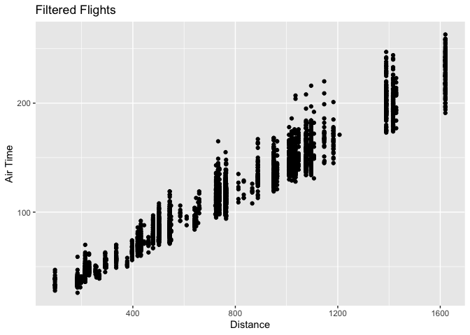
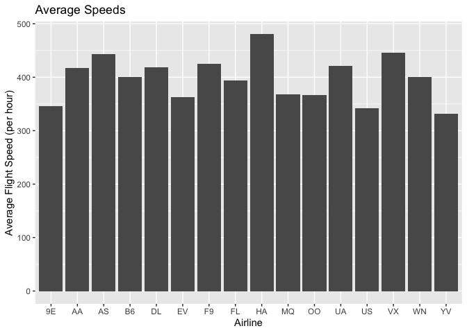

# Hmk_04: Data frames and data wrangling

Load needed packages

``` r
library(tidyverse)
```

    ── Attaching core tidyverse packages ──────────────────────── tidyverse 2.0.0 ──
    ✔ dplyr     1.1.2     ✔ readr     2.1.4
    ✔ forcats   1.0.0     ✔ stringr   1.5.0
    ✔ ggplot2   3.4.3     ✔ tibble    3.2.1
    ✔ lubridate 1.9.2     ✔ tidyr     1.3.0
    ✔ purrr     1.0.2     
    ── Conflicts ────────────────────────────────────────── tidyverse_conflicts() ──
    ✖ dplyr::filter() masks stats::filter()
    ✖ dplyr::lag()    masks stats::lag()
    ℹ Use the conflicted package (<http://conflicted.r-lib.org/>) to force all conflicts to become errors

``` r
library(nycflights13)
```

# Question 1: filtering

Make a plot of air time as a function of distance (air time on the y
axis, distance on the x axis) for all flights that meet the following
criteria:

- originate from LaGuardia airport (“LGA”)
- departed on the 16th of the month
- have a flight distance of less than 2000

``` r
flights %>% 
  filter(origin == "LGA", # filtering by departure location
         day == "16",  # filtering by departure day
         distance <2000) %>% # filtering by distance flown
  ggplot(mapping = aes(x = distance, y = air_time)) + #setting mapping parameters
  geom_point(na.rm = TRUE) + # removing NA values while making a scatter plot
  labs(title = "Filtered Flights", # plot title
    x = "Distance", # x axis label
    y = "Air Time") # y axis label
```



# Question 2: dealing with NAs

Make a data frame of all of the rows of `flights` that have values for
*both* `arr_time` and `dep_time` - that is, neither of those values are
`NA`.

``` r
filtered.flghts <- flights %>% # choosing dataframe for reference
  filter(!is.na(arr_time), # removing NA arrival times
         !is.na(dep_time)) # removiinig NA departure times
```

## filtering NAs

`ggplot()` will automatically remove NA values from the plot, as you may
have seen in question 1, but it emits a warning message about that. Of
course you could silence the warning message using [chunk
options](https://bookdown.org/yihui/rmarkdown-cookbook/chunk-options.html),
but how could you prevent them from appearing in the first place?

Options for preventing the message about NAs include filtering out NAs
from the data set during the initial filtering steps or adding the
option `na.rm=TRUE` with the mapping function
`(geom_point(), geom_hist(), etc.)`.

# Question 3: adding columns

Create a data frame of average flight speeds, based on `air_time` and
`distance`. Make either a histogram or a density plot of the data. If
you like, you may break the data out (e.g. by airline, or some other
variable) in a way that you think makes sense.

``` r
avg.speeds <- flights %>% # dataframe of reference
  mutate(speed = distance/(air_time/60)) %>% # calculating speed/hour
  group_by(carrier) %>% # grouping by carrier to calculate an average
  summarise(avg_speed = mean(speed, na.rm = TRUE)) # calculating average speed per airline

avg.speeds %>% # data frame of reference
  ggplot(mapping = aes(x = carrier, # calling ggplot and x axis mapping
                        y = avg_speed)) + # y axis mapping
  geom_col(na.rm = TRUE) + # making a bar chart and removing NA values
  labs(title = "Average Speeds", # plot title
       x = "Airline", # x axis label
       y = "Average Flight Speed (per hour)") # y axis label
```


